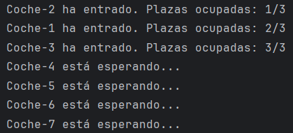
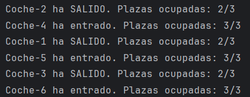
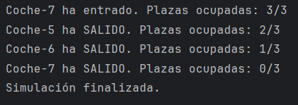

# 🚗 Simulación de Aparcamiento Concurrente en Java 🅿️

## 📄 Descripción
Este proyecto simula un **aparcamiento con plazas limitadas** donde varios coches intentan entrar y salir de manera **concurrente**. Cada coche se representa mediante un **hilo** (`Thread`) que intenta aparcar, permanece estacionado un tiempo aleatorio y luego libera la plaza.  

El objetivo es demostrar cómo manejar recursos compartidos (plazas del aparcamiento) usando **semáforos** (`Semaphore`) y garantizar la **concurrencia segura**. ⚡

---

## 🏗️ Estructura del Proyecto

El proyecto consta de tres clases principales:

### 1️⃣ `Aparcamiento`
- Representa el aparcamiento y controla las plazas disponibles.  
- Usa un **semáforo (`Semaphore`)** para gestionar el acceso concurrente.
- Métodos principales:
  - `entrar(String nombreCoche)` → El coche intenta ocupar una plaza. Si no hay plazas libres, espera. ⏳  
  - `salir(String nombreCoche)` → El coche libera la plaza ocupada. ✅

### 2️⃣ `Coche`

- Representa un coche que intenta aparcar.
- Implementa Runnable para poder ejecutarse como hilo.
- Comportamiento:
  - Llama a Aparcamiento.entrar() para intentar aparcar. 🚘
  - Permanece estacionado un tiempo aleatorio entre 1 y 4 segundos. ⏱️
  - Llama a Aparcamiento.salir() para liberar la plaza. 🅿️

### 3️⃣ `PrincipalParking`

- Clase principal que lanza la simulación.
- Configura el número de plazas y coches, crea los hilos y los ejecuta.
- Pasos de ejecución:
  - Crear el aparcamiento con Plazas definidas. 🏢
  - Crear un hilo para cada coche. 🚗
  - Iniciar todos los hilos (start()). ▶️
  - Esperar a que todos los hilos finalicen (join()). ⏳
  - Mostrar mensaje de finalización de la simulación. 🎉
 
---

## 🖥️ Ejemplo de salida

---

## ⚙️ Tecnologías utilizadas

- Java SE 8+ ☕
- Clases clave:
  - Thread y Runnable → para concurrencia.
  - Semaphore → para controlar el acceso a plazas limitadas.

 ---

## 🧠 Conceptos principales

### 1. Concurrencia y sincronización

- Varias instancias de Coche pueden intentar aparcar al mismo tiempo.
- Se usa Semaphore y bloques synchronized para evitar condiciones de carrera. ⚡

### 2. Semáforo (Semaphore)

- Controla cuántos coches pueden estar dentro del aparcamiento simultáneamente.
- tryAcquire() → intenta adquirir una plaza sin bloquear si está vacía. ⏱️
- acquire() → espera hasta que haya una plaza disponible. 🕒
- release() → libera una plaza. ✅

### 3. Bloques synchronized

- Se usan para actualizar de forma segura el contador de plazas ocupadas (Ocupadas) y evitar inconsistencias en la salida de mensajes. 🔒

---

## 💭 Reflexión acerca de Semaphore

Elegí Semaphore para limitar el acceso a una plaza de aparcamiento porque permite limitar de un modo muy sencillo el número de coches que pueden ocupar la plaza de aparcamiento al mismo tiempo: cada permiso del semáforo se puede interpretar como una plaza de aparcamiento libre, y al entrar un coche, este coche se lleva un permiso del semáforo y, al salir, devuelve el permiso del semáforo nuevamente.

Esto ofrece varias ventajas respecto a otras alternativas:

### - synchronized:
synchronized protege las secciones críticas, pero no permite contar los recursos limitados con la naturalidad de un semáforo, que para el caso del aparcamiento es muy útil porque se delega la gestión del límite de plazas al propio semáforo, sin tener que escribir la lógica para hacerlo.

### - wait() / notify () :
wait() y notify() permiten coordinar hilos, pero requieren una mayor cantidad de código y tener más cuidado para manejar adecuadamente la condición de espera, que en Semaphore se evita, ya que automáticamente se notifica la entrada y salida de coches.

### - ReentrantLock:
Un ReentrantLock tiene una similar protección a synchronized, pero en el caso de los permisos, no permite mantener un conteo integrado, mientras que Semaphore gestiona muy bien un número arbitrariamente grande de plazas y una vez más asegura que los coches entren en orden FIFO (justificando fair=true)
